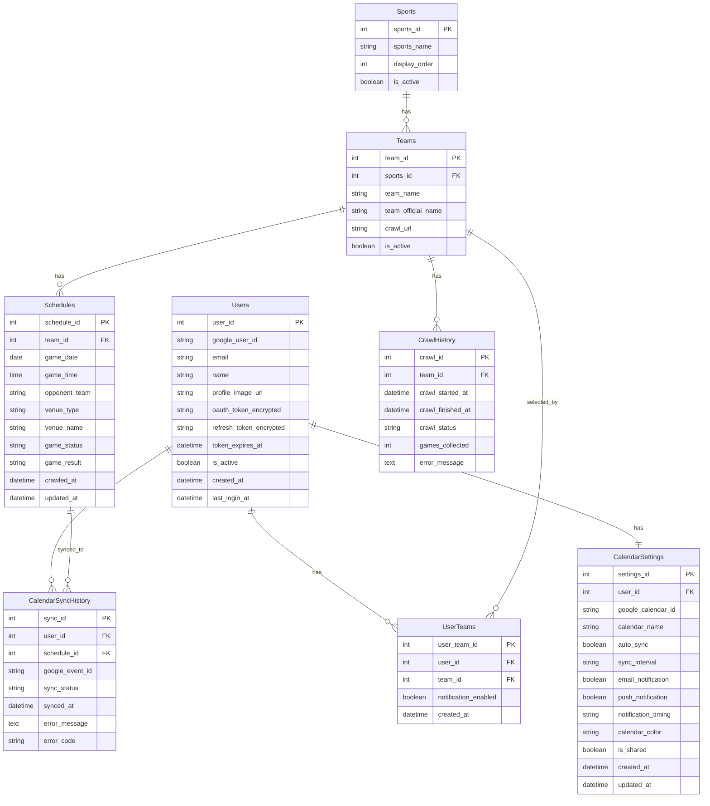

# 스포츠팀 경기일정 캘린더 웹사이트 데이터베이스 설계서

## 1. 시스템 개요

### 데이터베이스의 목적과 역할

이 데이터베이스는 스포츠팀 경기일정 캘린더 웹사이트의 핵심 데이터를 저장하고 관리합니다. 주요 역할은 다음과 같습니다:

- ✅ 사용자 인증 정보 관리 (Google OAuth) (iCloud → Google 변경)
- ✅ 사용자별 설정 및 선호도 관리
- 스포츠 종목 및 팀 정보 관리
- 크롤링한 경기일정 데이터 저장 및 관리
- ✅ Google 캘린더 연동 정보 및 동기화 이력 관리 (iCloud → Google 변경)
- ✅ 알림 설정 관리 (이메일, 푸시)
- ✅ 캘린더 공유 정보 관리 (선택)
- 크롤링 이력 추적 (선택)
- 캐시 관리 및 성능 최적화

### 전체 아키텍처 개요

```
┌─────────────────────────────────────────┐
│         Frontend (Web UI)                │
│  - React/Vue 캘린더 컴포넌트             │
└─────────────────┬───────────────────────┘
                  │ REST API
┌─────────────────▼───────────────────────┐
│         Backend API Server               │
│  - 크롤링 스케줄러                        │
│  - 데이터 파싱 로직                       │
└─────────────────┬───────────────────────┘
                  │
┌─────────────────▼───────────────────────┐
│         Data Storage                     │
│  - SQLite / JSON 파일 / 경량 DB          │
│  - 스포츠, 팀, 경기일정 데이터           │
└─────────────────────────────────────────┘
```

### 기술 선택 사유

**개인 프로젝트 특성상 경량 데이터베이스 권장**:

1. **SQLite** (권장)
   - 서버리스 환경에 적합
   - 파일 기반으로 배포 간단
   - SQL 표준 지원
   - 초소형 프로젝트에 최적

2. **JSON 파일** (대안)
   - 가장 간단한 구조
   - 별도 DB 엔진 불필요
   - 데이터 양이 매우 적을 때 적합

3. **PostgreSQL/MySQL** (확장 시)
   - 향후 다중 사용자 지원 시 고려
   - 클라우드 서버 사용 시

**최종 추천**: 초기 단계에서는 **SQLite** 사용, 향후 확장 시 관계형 DB로 마이그레이션 가능

## 2. 개념 데이터 모델

### 엔터티 정의서

#### 2.1 Sports (스포츠 종목)

**엔터티 명**: Sports

**개요 및 목적**: 
- 지원하는 스포츠 종목 정보를 관리
- 예: 야구, 축구, 농구 등

**주요 속성**:
- 스포츠 ID (식별자)
- 스포츠 이름 (예: 야구, 축구, 농구)
- 표시 순서
- 활성화 여부

**비즈니스 규칙**:
- 각 스포츠는 고유한 ID를 가짐
- 스포츠 이름은 중복 불가
- 삭제 대신 비활성화 처리 (데이터 무결성)

#### 2.2 Teams (팀)

**엔터티 명**: Teams

**개요 및 목적**:
- 스포츠 종목별 팀 정보를 관리
- 크롤링 대상 팀 식별

**주요 속성**:
- 팀 ID (식별자)
- 스포츠 ID (외래키)
- 팀 이름
- 팀 공식 이름 (선택)
- 크롤링 URL 또는 식별자
- 활성화 여부

**비즈니스 규칙**:
- 각 팀은 특정 스포츠 종목에 속함
- 같은 스포츠 내에서 팀 이름은 고유
- 크롤링 URL은 팀별로 고유

#### 2.3 Schedules (경기일정)

**엔터티 명**: Schedules

**개요 및 목적**:
- 크롤링한 경기일정 데이터를 저장
- 캘린더 표시를 위한 핵심 데이터

**주요 속성**:
- 경기 ID (식별자)
- 팀 ID (외래키)
- 경기 날짜
- 경기 시간
- 상대팀 이름
- 장소 (홈/원정 구분)
- 경기장 이름
- 경기 상태 (예정/진행중/종료)
- 경기 결과 (선택)
- 크롤링 일시
- 수정 일시

**비즈니스 규칙**:
- 각 경기는 특정 팀에 속함
- 경기 날짜와 시간은 필수
- 같은 팀의 같은 날짜 경기는 중복 불가 (단, 더블헤더 등 예외 고려 필요)
- 경기 결과는 경기 종료 후 업데이트 가능

#### 2.4 CrawlHistory (크롤링 이력) - 선택

**엔터티 명**: CrawlHistory

**개요 및 목적**:
- 크롤링 실행 이력을 추적
- 크롤링 성공/실패 모니터링
- 디버깅 및 문제 해결 지원

**주요 속성**:
- 크롤링 ID (식별자)
- 팀 ID (외래키)
- 크롤링 시작 일시
- 크롤링 종료 일시
- 크롤링 상태 (성공/실패)
- 수집된 경기 수
- 에러 메시지 (선택)

**비즈니스 규칙**:
- 각 크롤링 실행은 이력으로 기록
- 실패한 크롤링은 에러 메시지 저장
- 오래된 이력은 주기적으로 정리 가능

#### 2.5 Users (사용자) - ✅ 추가

**엔터티 명**: Users

**개요 및 목적**:
- Google 계정으로 로그인한 사용자 정보 관리 (iCloud → Google 변경)
- 사용자 인증 및 세션 관리

**주요 속성**:
- 사용자 ID (식별자)
- Google 사용자 식별자 (Google ID)
- 이메일 주소
- 이름 (선택)
- 프로필 이미지 URL (선택)
- OAuth 토큰 (암호화된 저장)
- Refresh 토큰 (암호화된 저장)
- 토큰 만료 일시
- 활성화 여부
- 생성 일시
- 최종 로그인 일시

**비즈니스 규칙**:
- 각 사용자는 고유한 Google 사용자 식별자로 식별
- OAuth 토큰은 반드시 암호화하여 저장
- 토큰 만료 시 자동 갱신 또는 재로그인 필요
- Google OAuth는 Refresh Token을 통한 자동 갱신 지원

#### 2.6 UserTeams (사용자별 팀 설정) - ✅ 추가

**엔터티 명**: UserTeams

**개요 및 목적**:
- 사용자별로 관심 있는 팀 설정 관리
- 사용자별 경기일정 필터링

**주요 속성**:
- 사용자팀 ID (식별자)
- 사용자 ID (외래키)
- 팀 ID (외래키)
- 알림 설정 (선택)
- 생성 일시

**비즈니스 규칙**:
- 한 사용자는 여러 팀을 선택 가능
- 한 팀은 여러 사용자에게 선택될 수 있음
- 사용자 삭제 시 관련 설정도 삭제 (CASCADE)

#### 2.7 CalendarSettings (캘린더 연동 설정) - ✅ 추가

**엔터티 명**: CalendarSettings

**개요 및 목적**:
- 사용자별 Google 캘린더 연동 설정 관리 (iCloud → Google 변경)
- 캘린더 선택 및 동기화 설정
- 알림 설정 관리

**주요 속성**:
- 설정 ID (식별자)
- 사용자 ID (외래키)
- Google 캘린더 ID
- 캘린더 이름
- 자동 동기화 여부
- 동기화 주기
- 이메일 알림 여부
- 푸시 알림 여부
- 알림 시점 (경기 전 일수/시간)
- 캘린더 색상 (선택)
- 공유 설정 (선택)
- 생성 일시
- 수정 일시

**비즈니스 규칙**:
- 한 사용자는 하나의 캘린더 설정만 가짐 (1:1)
- 사용자 삭제 시 설정도 삭제 (CASCADE)
- Google 캘린더 ID는 Google Calendar API에서 제공하는 고유 식별자

#### 2.8 CalendarSyncHistory (캘린더 동기화 이력) - ✅ 추가

**엔터티 명**: CalendarSyncHistory

**개요 및 목적**:
- Google 캘린더로의 경기일정 동기화 이력 추적 (iCloud → Google 변경)
- 동기화 성공/실패 모니터링

**주요 속성**:
- 동기화 ID (식별자)
- 사용자 ID (외래키)
- 경기 ID (외래키)
- Google 이벤트 ID (Google Calendar API에서 제공)
- 동기화 상태 (성공/실패/대기중)
- 동기화 일시
- 에러 메시지 (선택)
- 에러 코드 (선택, Google API 에러 코드)

**비즈니스 규칙**:
- 각 동기화는 이력으로 기록
- 실패한 동기화는 에러 메시지 및 에러 코드 저장
- Google 이벤트 ID는 동기화 성공 시 저장
- 오래된 이력은 주기적으로 정리 가능

### 개념 ERD



### 엔터티 관계 매트릭스

| 엔터티 | Users | UserTeams | CalendarSettings | CalendarSyncHistory | Sports | Teams | Schedules | CrawlHistory |
|--------|-------|-----------|-----------------|---------------------|--------|-------|-----------|--------------|
| Users | - | 1:N | 1:1 | 1:N | - | - | - | - |
| UserTeams | N:1 | - | - | - | - | N:1 | - | - |
| CalendarSettings | 1:1 | - | - | - | - | - | - | - |
| CalendarSyncHistory | N:1 | - | - | - | - | - | N:1 | - |
| Sports | - | - | - | - | - | 1:N | - | - |
| Teams | - | 1:N | - | - | N:1 | - | 1:N | 1:N |
| Schedules | - | - | - | 1:N | - | N:1 | - | - |
| CrawlHistory | - | - | - | - | - | N:1 | - | - |

**관계 설명**:
- Users → UserTeams: 1:N (한 사용자는 여러 팀을 선택 가능)
- Users → CalendarSettings: 1:1 (한 사용자는 하나의 캘린더 설정만 가짐)
- Users → CalendarSyncHistory: 1:N (한 사용자는 여러 동기화 이력을 가짐)
- Teams → UserTeams: 1:N (한 팀은 여러 사용자에게 선택될 수 있음)
- Schedules → CalendarSyncHistory: 1:N (한 경기는 여러 동기화 이력을 가짐)
- Sports → Teams: 1:N (한 스포츠 종목은 여러 팀을 가짐)
- Teams → Schedules: 1:N (한 팀은 여러 경기일정을 가짐)
- Teams → CrawlHistory: 1:N (한 팀은 여러 크롤링 이력을 가짐)

## 3. 논리 데이터 모델

### 논리 테이블 정의

#### 3.1 sports (스포츠 종목 테이블)

**테이블명**:
- 논리명: 스포츠 종목
- 물리명: sports

**목적 및 개요**: 지원하는 스포츠 종목 정보를 관리

**컬럼 정의**:

| 논리명 | 물리명 | 데이터형 | 길이 | NULL | 기본값 | 설명 |
|--------|--------|---------|------|------|--------|------|
| 스포츠ID | sports_id | INTEGER | - | NOT NULL | AUTO_INCREMENT | 기본키 |
| 스포츠명 | sports_name | VARCHAR | 50 | NOT NULL | - | 야구, 축구, 농구 등 |
| 표시순서 | display_order | INTEGER | - | NULL | 0 | UI 표시 순서 |
| 활성화여부 | is_active | BOOLEAN | - | NOT NULL | TRUE | 활성/비활성 |
| 생성일시 | created_at | DATETIME | - | NOT NULL | CURRENT_TIMESTAMP | 레코드 생성 일시 |
| 수정일시 | updated_at | DATETIME | - | NULL | - | 레코드 수정 일시 |

**기본키**: sports_id

**유니크 제약**: sports_name (UNIQUE)

**체크 제약**: display_order >= 0

#### 3.2 teams (팀 테이블)

**테이블명**:
- 논리명: 팀
- 물리명: teams

**목적 및 개요**: 스포츠 종목별 팀 정보 관리

**컬럼 정의**:

| 논리명 | 물리명 | 데이터형 | 길이 | NULL | 기본값 | 설명 |
|--------|--------|---------|------|------|--------|------|
| 팀ID | team_id | INTEGER | - | NOT NULL | AUTO_INCREMENT | 기본키 |
| 스포츠ID | sports_id | INTEGER | - | NOT NULL | - | 외래키 (sports.sports_id) |
| 팀명 | team_name | VARCHAR | 100 | NOT NULL | - | 팀 이름 (예: LG 트윈스) |
| 팀공식명 | team_official_name | VARCHAR | 100 | NULL | - | 팀 공식 이름 |
| 크롤링URL | crawl_url | VARCHAR | 500 | NOT NULL | - | 크롤링 대상 URL 또는 식별자 |
| 크롤링설정 | crawl_config | TEXT | - | NULL | - | 크롤링 설정 (JSON) |
| 활성화여부 | is_active | BOOLEAN | - | NOT NULL | TRUE | 활성/비활성 |
| 생성일시 | created_at | DATETIME | - | NOT NULL | CURRENT_TIMESTAMP | 레코드 생성 일시 |
| 수정일시 | updated_at | DATETIME | - | NULL | - | 레코드 수정 일시 |

**기본키**: team_id

**외래키**: sports_id → sports.sports_id

**유니크 제약**: (sports_id, team_name) UNIQUE

**인덱스**: 
- idx_teams_sports_id (sports_id)
- idx_teams_crawl_url (crawl_url)

#### 3.3 schedules (경기일정 테이블)

**테이블명**:
- 논리명: 경기일정
- 물리명: schedules

**목적 및 개요**: 크롤링한 경기일정 데이터 저장

**컬럼 정의**:

| 논리명 | 물리명 | 데이터형 | 길이 | NULL | 기본값 | 설명 |
|--------|--------|---------|------|------|--------|------|
| 경기ID | schedule_id | INTEGER | - | NOT NULL | AUTO_INCREMENT | 기본키 |
| 팀ID | team_id | INTEGER | - | NOT NULL | - | 외래키 (teams.team_id) |
| 경기날짜 | game_date | DATE | - | NOT NULL | - | 경기 날짜 |
| 경기시간 | game_time | TIME | - | NULL | - | 경기 시간 |
| 상대팀명 | opponent_team | VARCHAR | 100 | NOT NULL | - | 상대팀 이름 |
| 장소구분 | venue_type | VARCHAR | 10 | NOT NULL | - | 홈/원정 (HOME/AWAY) |
| 경기장명 | venue_name | VARCHAR | 200 | NULL | - | 경기장 이름 |
| 경기상태 | game_status | VARCHAR | 20 | NOT NULL | 'SCHEDULED' | 예정/진행중/종료 |
| 경기결과 | game_result | VARCHAR | 50 | NULL | - | 승/패/무 (선택) |
| 점수 | score | VARCHAR | 50 | NULL | - | 점수 (예: 3-2) |
| 크롤링일시 | crawled_at | DATETIME | - | NOT NULL | CURRENT_TIMESTAMP | 크롤링 일시 |
| 수정일시 | updated_at | DATETIME | - | NULL | - | 레코드 수정 일시 |

**기본키**: schedule_id

**외래키**: team_id → teams.team_id

**유니크 제약**: (team_id, game_date, game_time, opponent_team) UNIQUE

**체크 제약**: 
- venue_type IN ('HOME', 'AWAY')
- game_status IN ('SCHEDULED', 'IN_PROGRESS', 'FINISHED', 'CANCELLED')

**인덱스**:
- idx_schedules_team_id (team_id)
- idx_schedules_game_date (game_date)
- idx_schedules_game_date_team (game_date, team_id) - 복합 인덱스

#### 3.4 crawl_history (크롤링 이력 테이블) - 선택

**테이블명**:
- 논리명: 크롤링 이력
- 물리명: crawl_history

**목적 및 개요**: 크롤링 실행 이력 추적

**컬럼 정의**:

| 논리명 | 물리명 | 데이터형 | 길이 | NULL | 기본값 | 설명 |
|--------|--------|---------|------|------|--------|------|
| 크롤링ID | crawl_id | INTEGER | - | NOT NULL | AUTO_INCREMENT | 기본키 |
| 팀ID | team_id | INTEGER | - | NOT NULL | - | 외래키 (teams.team_id) |
| 크롤링시작일시 | crawl_started_at | DATETIME | - | NOT NULL | CURRENT_TIMESTAMP | 크롤링 시작 일시 |
| 크롤링종료일시 | crawl_finished_at | DATETIME | - | NULL | - | 크롤링 종료 일시 |
| 크롤링상태 | crawl_status | VARCHAR | 20 | NOT NULL | 'RUNNING' | 성공/실패/실행중 |
| 수집경기수 | games_collected | INTEGER | - | NULL | 0 | 수집된 경기 수 |
| 에러메시지 | error_message | TEXT | - | NULL | - | 에러 발생 시 메시지 |

**기본키**: crawl_id

**외래키**: team_id → teams.team_id

**체크 제약**: crawl_status IN ('RUNNING', 'SUCCESS', 'FAILED')

**인덱스**:
- idx_crawl_history_team_id (team_id)
- idx_crawl_history_started_at (crawl_started_at)

### 논리 ERD

논리 ERD는 개념 ERD와 동일하지만, 구체적인 컬럼 정보를 포함합니다.

### 정규화 검증 결과

#### 1차 정규화 (1NF)
- ✅ 모든 컬럼은 원자값을 가짐
- ✅ 중복 그룹 없음

#### 2차 정규화 (2NF)
- ✅ 모든 비키 속성이 기본키에 완전 함수 종속
- ✅ 부분 함수 종속 없음

#### 3차 정규화 (3NF)
- ✅ 이행 종속 없음
- ✅ 모든 비키 속성이 기본키에만 종속

**정규화 결과**: 모든 테이블이 3NF를 만족합니다.

## 4. 물리 데이터 모델

### 물리 테이블 정의

#### 4.1 DDL 문 (SQLite 기준)

```sql
-- 스포츠 종목 테이블
CREATE TABLE sports (
    sports_id INTEGER PRIMARY KEY AUTOINCREMENT,
    sports_name VARCHAR(50) NOT NULL UNIQUE,
    display_order INTEGER DEFAULT 0,
    is_active BOOLEAN NOT NULL DEFAULT 1,
    created_at DATETIME NOT NULL DEFAULT CURRENT_TIMESTAMP,
    updated_at DATETIME
);

-- 팀 테이블
CREATE TABLE teams (
    team_id INTEGER PRIMARY KEY AUTOINCREMENT,
    sports_id INTEGER NOT NULL,
    team_name VARCHAR(100) NOT NULL,
    team_official_name VARCHAR(100),
    crawl_url VARCHAR(500) NOT NULL,
    crawl_config TEXT,
    is_active BOOLEAN NOT NULL DEFAULT 1,
    created_at DATETIME NOT NULL DEFAULT CURRENT_TIMESTAMP,
    updated_at DATETIME,
    FOREIGN KEY (sports_id) REFERENCES sports(sports_id) ON DELETE RESTRICT,
    UNIQUE(sports_id, team_name)
);

-- 경기일정 테이블
CREATE TABLE schedules (
    schedule_id INTEGER PRIMARY KEY AUTOINCREMENT,
    team_id INTEGER NOT NULL,
    game_date DATE NOT NULL,
    game_time TIME,
    opponent_team VARCHAR(100) NOT NULL,
    venue_type VARCHAR(10) NOT NULL CHECK (venue_type IN ('HOME', 'AWAY')),
    venue_name VARCHAR(200),
    game_status VARCHAR(20) NOT NULL DEFAULT 'SCHEDULED' CHECK (game_status IN ('SCHEDULED', 'IN_PROGRESS', 'FINISHED', 'CANCELLED')),
    game_result VARCHAR(50),
    score VARCHAR(50),
    crawled_at DATETIME NOT NULL DEFAULT CURRENT_TIMESTAMP,
    updated_at DATETIME,
    FOREIGN KEY (team_id) REFERENCES teams(team_id) ON DELETE CASCADE,
    UNIQUE(team_id, game_date, game_time, opponent_team)
);

-- 크롤링 이력 테이블 (선택)
CREATE TABLE crawl_history (
    crawl_id INTEGER PRIMARY KEY AUTOINCREMENT,
    team_id INTEGER NOT NULL,
    crawl_started_at DATETIME NOT NULL DEFAULT CURRENT_TIMESTAMP,
    crawl_finished_at DATETIME,
    crawl_status VARCHAR(20) NOT NULL DEFAULT 'RUNNING' CHECK (crawl_status IN ('RUNNING', 'SUCCESS', 'FAILED')),
    games_collected INTEGER DEFAULT 0,
    error_message TEXT,
    FOREIGN KEY (team_id) REFERENCES teams(team_id) ON DELETE CASCADE
);

-- 사용자 테이블 (✅ Google OAuth)
CREATE TABLE users (
    user_id INTEGER PRIMARY KEY AUTOINCREMENT,
    google_user_id VARCHAR(255) NOT NULL UNIQUE,
    email VARCHAR(255) NOT NULL,
    name VARCHAR(100),
    profile_image_url VARCHAR(500),
    oauth_token_encrypted TEXT NOT NULL,
    refresh_token_encrypted TEXT NOT NULL,
    token_expires_at DATETIME NOT NULL,
    is_active BOOLEAN NOT NULL DEFAULT 1,
    created_at DATETIME NOT NULL DEFAULT CURRENT_TIMESTAMP,
    last_login_at DATETIME
);

-- 사용자별 팀 설정 테이블 (✅ 추가)
CREATE TABLE user_teams (
    user_team_id INTEGER PRIMARY KEY AUTOINCREMENT,
    user_id INTEGER NOT NULL,
    team_id INTEGER NOT NULL,
    notification_enabled BOOLEAN DEFAULT 0,
    created_at DATETIME NOT NULL DEFAULT CURRENT_TIMESTAMP,
    FOREIGN KEY (user_id) REFERENCES users(user_id) ON DELETE CASCADE,
    FOREIGN KEY (team_id) REFERENCES teams(team_id) ON DELETE CASCADE,
    UNIQUE(user_id, team_id)
);

-- 캘린더 연동 설정 테이블 (✅ Google 캘린더)
CREATE TABLE calendar_settings (
    settings_id INTEGER PRIMARY KEY AUTOINCREMENT,
    user_id INTEGER NOT NULL UNIQUE,
    google_calendar_id VARCHAR(255) NOT NULL,
    calendar_name VARCHAR(100) NOT NULL,
    auto_sync BOOLEAN NOT NULL DEFAULT 1,
    sync_interval VARCHAR(20) DEFAULT 'DAILY' CHECK (sync_interval IN ('HOURLY', 'DAILY', 'WEEKLY')),
    email_notification BOOLEAN NOT NULL DEFAULT 1,
    push_notification BOOLEAN NOT NULL DEFAULT 1,
    notification_timing VARCHAR(50) DEFAULT '1일전,1시간전' CHECK (notification_timing IN ('1일전', '1시간전', '30분전', '1일전,1시간전', '1일전,1시간전,30분전')),
    calendar_color VARCHAR(20),
    is_shared BOOLEAN NOT NULL DEFAULT 0,
    created_at DATETIME NOT NULL DEFAULT CURRENT_TIMESTAMP,
    updated_at DATETIME,
    FOREIGN KEY (user_id) REFERENCES users(user_id) ON DELETE CASCADE
);

-- 캘린더 동기화 이력 테이블 (✅ Google 캘린더)
CREATE TABLE calendar_sync_history (
    sync_id INTEGER PRIMARY KEY AUTOINCREMENT,
    user_id INTEGER NOT NULL,
    schedule_id INTEGER NOT NULL,
    google_event_id VARCHAR(255),
    sync_status VARCHAR(20) NOT NULL CHECK (sync_status IN ('SUCCESS', 'FAILED', 'PENDING')),
    synced_at DATETIME NOT NULL DEFAULT CURRENT_TIMESTAMP,
    error_message TEXT,
    error_code VARCHAR(50),
    FOREIGN KEY (user_id) REFERENCES users(user_id) ON DELETE CASCADE,
    FOREIGN KEY (schedule_id) REFERENCES schedules(schedule_id) ON DELETE CASCADE
);
```

#### 4.2 인덱스 정의

```sql
-- teams 테이블 인덱스
CREATE INDEX idx_teams_sports_id ON teams(sports_id);
CREATE INDEX idx_teams_crawl_url ON teams(crawl_url);
CREATE INDEX idx_teams_active ON teams(is_active);

-- schedules 테이블 인덱스
CREATE INDEX idx_schedules_team_id ON schedules(team_id);
CREATE INDEX idx_schedules_game_date ON schedules(game_date);
CREATE INDEX idx_schedules_game_date_team ON schedules(game_date, team_id);
CREATE INDEX idx_schedules_status ON schedules(game_status);

-- crawl_history 테이블 인덱스
CREATE INDEX idx_crawl_history_team_id ON crawl_history(team_id);
CREATE INDEX idx_crawl_history_started_at ON crawl_history(crawl_started_at);
CREATE INDEX idx_crawl_history_status ON crawl_history(crawl_status);

-- users 테이블 인덱스
CREATE INDEX idx_users_google_user_id ON users(google_user_id);
CREATE INDEX idx_users_email ON users(email);
CREATE INDEX idx_users_active ON users(is_active);

-- user_teams 테이블 인덱스
CREATE INDEX idx_user_teams_user_id ON user_teams(user_id);
CREATE INDEX idx_user_teams_team_id ON user_teams(team_id);

-- calendar_settings 테이블 인덱스
CREATE INDEX idx_calendar_settings_user_id ON calendar_settings(user_id);

-- calendar_sync_history 테이블 인덱스
CREATE INDEX idx_calendar_sync_history_user_id ON calendar_sync_history(user_id);
CREATE INDEX idx_calendar_sync_history_schedule_id ON calendar_sync_history(schedule_id);
CREATE INDEX idx_calendar_sync_history_status ON calendar_sync_history(sync_status);
CREATE INDEX idx_calendar_sync_history_synced_at ON calendar_sync_history(synced_at);
```

#### 4.3 파티션 정의

개인 프로젝트 특성상 파티셔닝은 불필요합니다. 향후 데이터가 대량으로 증가할 경우, `game_date` 기준으로 파티셔닝을 고려할 수 있습니다.

#### 4.4 스토리지 파라미터

SQLite는 파일 기반이므로 별도의 스토리지 파라미터 설정이 필요 없습니다.

### 성능 설계

#### 인덱스 전략

**주요 쿼리 패턴 분석**:

1. **경기일정 조회** (가장 빈번)
   ```sql
   SELECT * FROM schedules 
   WHERE team_id = ? AND game_date >= ? AND game_date <= ?
   ORDER BY game_date, game_time;
   ```
   - 인덱스: `idx_schedules_game_date_team` (game_date, team_id) 복합 인덱스

2. **팀 목록 조회**
   ```sql
   SELECT * FROM teams WHERE sports_id = ? AND is_active = 1;
   ```
   - 인덱스: `idx_teams_sports_id` (sports_id)

3. **크롤링 데이터 삽입**
   ```sql
   INSERT INTO schedules (...) VALUES (...)
   ON CONFLICT (team_id, game_date, game_time, opponent_team) 
   DO UPDATE SET ...;
   ```
   - 유니크 제약이 자동으로 인덱스 생성

**인덱스 최적화 원칙**:
- 읽기 성능 최우선 (쓰기는 빈도가 낮음)
- 자주 조회되는 컬럼에 인덱스 생성
- 복합 인덱스는 쿼리 패턴에 맞게 설계

#### 쿼리 최적화 전략

1. **SELECT 최적화**:
   - 필요한 컬럼만 선택 (SELECT *)
   - WHERE 절에 인덱스 활용
   - ORDER BY는 인덱스 활용 가능하도록 설계

2. **INSERT 최적화**:
   - 배치 INSERT 사용 (여러 경기일정 동시 삽입)
   - 트랜잭션 활용하여 성능 향상

3. **UPDATE 최적화**:
   - WHERE 절에 인덱스 활용
   - 불필요한 업데이트 방지

#### 캐시 활용 전략

1. **애플리케이션 레벨 캐싱**:
   - 스포츠 종목 목록: 메모리 캐시 (변경 빈도 낮음)
   - 팀 목록: 메모리 캐시 (변경 빈도 낮음)
   - 경기일정: 캘린더 기간별 캐싱 (예: 월별 캐시)

2. **캐시 무효화 전략**:
   - 크롤링 완료 후 해당 팀의 경기일정 캐시 무효화
   - TTL(Time To Live) 설정 (예: 1시간)

### 용량 설계

#### 데이터 양 추정

**현황 이해**: 개인 프로젝트로 초기 사용자는 1명(10살 아들), 향후 확장 가능성은 낮음

**추천안**:
- **스포츠 종목**: 5~10개 (초기), 연 1~2개 증가
- **팀**: 스포츠당 평균 10개 팀, 총 50~100개 팀
- **경기일정**: 팀당 연간 약 100경기, 총 약 5,000~10,000건/년
- **크롤링 이력**: 일 1회 크롤링, 연간 약 365건

**5년 후 예상 데이터**:
- ✅ users: 약 10개 레코드 (가족 및 친구 확장)
- ✅ user_teams: 약 50개 레코드 (사용자당 평균 5개 팀)
- ✅ calendar_settings: 약 10개 레코드
- ✅ calendar_sync_history: 약 10,000개 레코드 (사용자당 평균 1,000건)
- sports: 약 15개 레코드
- teams: 약 150개 레코드
- schedules: 약 50,000개 레코드 (5년치)
- crawl_history: 약 1,825개 레코드 (5년치)

#### 테이블 용량 예측

**레코드 크기 추정** (SQLite 기준):

- sports: 평균 100 bytes/레코드
  - 15개 레코드 × 100 bytes = 1.5 KB
  
- teams: 평균 200 bytes/레코드
  - 150개 레코드 × 200 bytes = 30 KB
  
- schedules: 평균 300 bytes/레코드
  - 50,000개 레코드 × 300 bytes = 15 MB
  
- crawl_history: 평균 200 bytes/레코드
  - 1,825개 레코드 × 200 bytes = 365 KB

- ✅ users: 평균 500 bytes/레코드
  - 10개 레코드 × 500 bytes = 5 KB
  
- ✅ user_teams: 평균 50 bytes/레코드
  - 50개 레코드 × 50 bytes = 2.5 KB
  
- ✅ calendar_settings: 평균 200 bytes/레코드
  - 10개 레코드 × 200 bytes = 2 KB
  
- ✅ calendar_sync_history: 평균 150 bytes/레코드
  - 10,000개 레코드 × 150 bytes = 1.5 MB

**총 예상 용량**: 약 18 MB (5년 후, 사용자 및 캘린더 연동 포함)

#### 디스크 사용 계획

- **초기**: 약 1 MB
- **1년 후**: 약 4 MB
- **5년 후**: 약 16 MB

**디스크 공간**: 최소 50 MB 할당 권장 (여유 공간 포함)

## 5. 데이터 사전

### 테이블 목록

| 테이블명 | 논리명 | 설명 | 레코드 수 (예상) |
|---------|--------|------|-----------------|
| users | 사용자 | Google 사용자 정보 | 10 |
| user_teams | 사용자별 팀 설정 | 사용자별 관심 팀 | 50 |
| calendar_settings | 캘린더 연동 설정 | Google 캘린더 설정 | 10 |
| calendar_sync_history | 캘린더 동기화 이력 | 동기화 이력 | 10,000 |
| sports | 스포츠 종목 | 스포츠 종목 정보 | 15 |
| teams | 팀 | 팀 정보 | 150 |
| schedules | 경기일정 | 경기일정 데이터 | 50,000 |
| crawl_history | 크롤링 이력 | 크롤링 실행 이력 | 1,825 |

### 컬럼 상세 정의

각 테이블의 컬럼 정의는 "3. 논리 데이터 모델" 섹션을 참조하세요.

### 코드값 정의

#### venue_type (장소 구분)

| 코드값 | 설명 |
|--------|------|
| HOME | 홈 경기 |
| AWAY | 원정 경기 |

#### game_status (경기 상태)

| 코드값 | 설명 |
|--------|------|
| SCHEDULED | 예정 |
| IN_PROGRESS | 진행중 |
| FINISHED | 종료 |
| CANCELLED | 취소 |

#### crawl_status (크롤링 상태)

| 코드값 | 설명 |
|--------|------|
| RUNNING | 실행중 |
| SUCCESS | 성공 |
| FAILED | 실패 |

#### sync_status (동기화 상태) - ✅ 추가

| 코드값 | 설명 |
|--------|------|
| SUCCESS | 동기화 성공 |
| FAILED | 동기화 실패 |
| PENDING | 동기화 대기중 |

#### sync_interval (동기화 주기) - ✅ 추가

| 코드값 | 설명 |
|--------|------|
| HOURLY | 시간별 |
| DAILY | 일별 |
| WEEKLY | 주별 |

### 도메인 정의

| 도메인명 | 데이터형 | 길이 | 설명 | 예시 |
|---------|---------|------|------|------|
| SportsName | VARCHAR | 50 | 스포츠 이름 | 야구, 축구, 농구 |
| TeamName | VARCHAR | 100 | 팀 이름 | LG 트윈스, 삼성 라이온즈 |
| URL | VARCHAR | 500 | URL | https://example.com |
| Date | DATE | - | 날짜 | 2024-03-15 |
| Time | TIME | - | 시간 | 18:30:00 |
| Status | VARCHAR | 20 | 상태 코드 | SCHEDULED, FINISHED |

## 6. 보안 설계

### 접근 제어 설계

**현황 이해**: ✅ Google OAuth 인증 필요 (iCloud → Google 변경)

**추천안**: 
- ✅ **사용자 인증**: Google OAuth 2.0을 통한 사용자 인증
- ✅ **데이터 격리**: 사용자별로 데이터 접근 제어 (user_id 필터링)
- ✅ **권한 관리**: 현재는 단일 사용자 권한만 필요 (향후 확장 가능)

**사용자/권한/역할 정의**:
- ✅ **현재**: Google 계정으로 로그인한 사용자만 접근 가능
- ✅ **데이터 격리**: 모든 데이터 조회 시 user_id 필터링 필수
- 향후: 다중 사용자 지원 시 역할 기반 접근 제어 (RBAC) 고려

### 데이터 암호화 설계

**현황 이해**: ✅ Google OAuth 토큰 저장 필요 (민감 정보)

**추천안**: 
- ✅ **OAuth 토큰 암호화**: `oauth_token_encrypted`, `refresh_token_encrypted` 컬럼은 반드시 암호화하여 저장
- ✅ **암호화 방법**: AES-256 암호화 또는 데이터베이스 레벨 암호화 기능 활용
- ✅ **환경 변수**: 암호화 키는 환경 변수로 관리 (절대 코드에 하드코딩 금지)
- 사용자 이메일은 일반 텍스트 저장 가능 (Google에서 제공하는 공개 정보)
- Google OAuth는 Refresh Token을 통한 자동 토큰 갱신 지원 (토큰 만료 전 갱신)

### 감사 로그 설계

**현황 이해**: 개인 프로젝트 특성상 감사 로그 불필요

**추천안**:
- 크롤링 이력 테이블로 크롤링 활동 추적
- 필요 시 상세 감사 로그 테이블 추가 가능

## 7. 운영 및 유지보수 설계

### 백업 설계

**현황 이해**: 개인 프로젝트로 정식 백업 프로세스 불필요

**추천안**:
- **백업 방식**: SQLite 파일 복사
- **스케줄**: 주 1회 또는 수동 백업
- **보관 방법**: 로컬 디스크 또는 클라우드 스토리지 (Git LFS, Dropbox 등)

**백업 스크립트 예시**:
```bash
#!/bin/bash
# 주간 백업 스크립트
DATE=$(date +%Y%m%d)
cp sports_schedule.db backups/sports_schedule_${DATE}.db
```

### 모니터링 설계

**모니터링 항목**:
- 데이터베이스 파일 크기
- 크롤링 성공률
- 최근 크롤링 일시

**알림 기준**:
- 크롤링 실패 시 로그 기록
- 데이터베이스 파일 크기 임계값 초과 시 알림 (선택)

### 정기 점검 설계

**유지보수 항목**:
- 주 1회: 데이터베이스 무결성 검사 (`PRAGMA integrity_check`)
- 월 1회: 오래된 크롤링 이력 정리 (1년 이상)
- 분기 1회: 인덱스 최적화 (`ANALYZE`)

**데이터 아카이빙 기준**:
- 3년 이상 된 경기일정 데이터는 별도 아카이브 테이블로 이동 (선택)
- 또는 삭제 (공개 정보이므로 재크롤링 가능)

## 8. 데이터 이관 설계

기존 시스템이 없으므로 데이터 이관 설계는 불필요합니다.

초기 데이터는 다음과 같이 수동 입력 또는 마이그레이션 스크립트로 삽입:

```sql
-- 초기 스포츠 종목 데이터
INSERT INTO sports (sports_name, display_order) VALUES
('야구', 1),
('축구', 2),
('농구', 3);

-- 초기 팀 데이터 (예시)
INSERT INTO teams (sports_id, team_name, crawl_url) VALUES
(1, 'LG 트윈스', 'https://example.com/lg-twins'),
(1, '삼성 라이온즈', 'https://example.com/samsung-lions');
```

## 9. 테스트 설계

### 단위 테스트 항목

1. **테이블 생성 테스트**
   - 모든 테이블이 정상 생성되는지 확인
   - 제약 조건이 올바르게 적용되는지 확인

2. **데이터 무결성 테스트**
   - 외래키 제약 확인
   - 유니크 제약 확인
   - 체크 제약 확인

3. **인덱스 테스트**
   - 인덱스가 정상 생성되는지 확인
   - 인덱스 활용 쿼리 성능 확인

### 통합 테스트 항목

1. **CRUD 작업 테스트**
   - 스포츠 종목 생성/조회/수정/삭제
   - 팀 생성/조회/수정/삭제
   - 경기일정 생성/조회/수정/삭제

2. **관계 테스트**
   - 스포츠 삭제 시 팀 제약 확인
   - 팀 삭제 시 경기일정 CASCADE 확인

3. **크롤링 플로우 테스트**
   - 크롤링 → 데이터 파싱 → 저장 전체 플로우

### 성능 테스트 항목

1. **쿼리 성능 테스트**
   - 경기일정 조회 쿼리 (1초 이내)
   - 팀 목록 조회 쿼리 (0.5초 이내)

2. **대용량 데이터 테스트**
   - 10,000건 이상 경기일정 데이터 조회 성능

3. **동시성 테스트**
   - 동시 크롤링 실행 시 데이터 무결성 확인

### 테스트 데이터 생성 방침

1. **초기 테스트 데이터**:
   - 스포츠: 3~5개
   - 팀: 스포츠당 2~3개
   - 경기일정: 팀당 10~20개

2. **성능 테스트 데이터**:
   - 경기일정: 10,000건 이상
   - 스크립트로 자동 생성

## 10. 추가 고려사항

### JSON 파일 대안 설계

SQLite 대신 JSON 파일을 사용하는 경우:

**파일 구조**:
```
data/
  ├── sports.json
  ├── teams.json
  ├── schedules/
  │   ├── team_1.json
  │   ├── team_2.json
  │   └── ...
  └── crawl_history.json
```

**장점**:
- 별도 DB 엔진 불필요
- 파일 직접 편집 가능
- Git으로 버전 관리 용이

**단점**:
- 동시성 제어 어려움
- 대용량 데이터 처리 비효율
- 쿼리 기능 없음

**추천**: 초기 프로토타입 단계에서만 사용, 프로덕션은 SQLite 권장

### 향후 확장 고려사항

1. **사용자 인증 추가 시**:
   - users 테이블 추가
   - user_preferences 테이블 추가 (사용자별 선호 팀)

2. **다중 팀 지원 시**:
   - user_teams 테이블 추가 (사용자-팀 매핑)

3. **알림 기능 추가 시**:
   - notifications 테이블 추가
   - notification_settings 테이블 추가

4. **경기 결과 상세 추가 시**:
   - game_stats 테이블 추가 (선택)

---

**작성일**: 2024-12-19
**작성자**: AI 데이터베이스 설계 전문가
**상태**: 설계 완료

**참고**: 이 설계는 개인 프로젝트 특성을 고려하여 간단하지만 확장 가능한 구조로 작성되었습니다. 실제 구현 시 프로젝트 요구사항에 맞게 조정이 필요할 수 있습니다.

