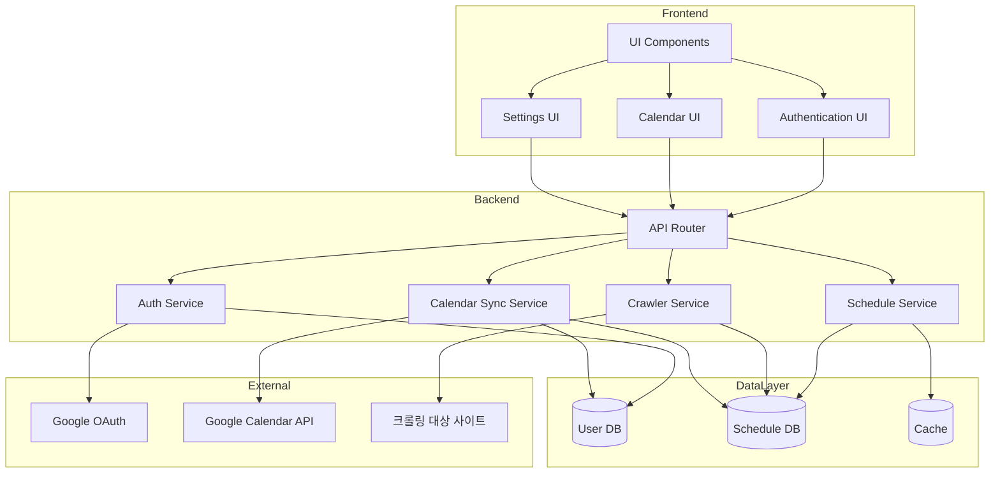
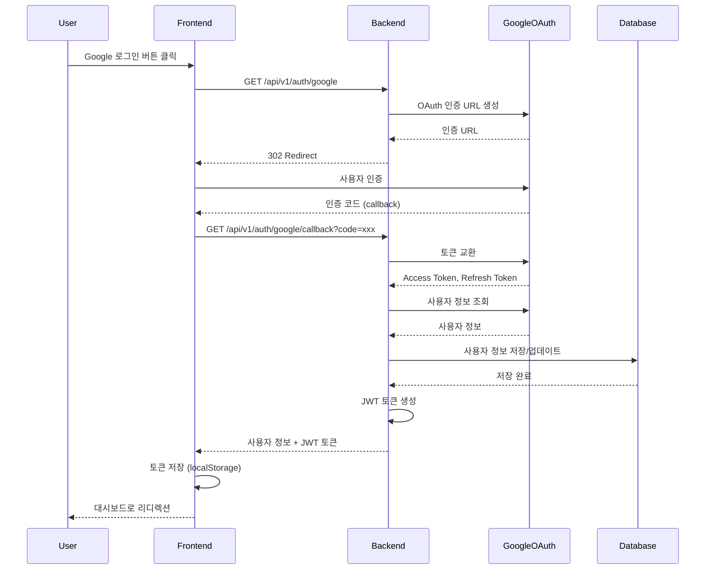
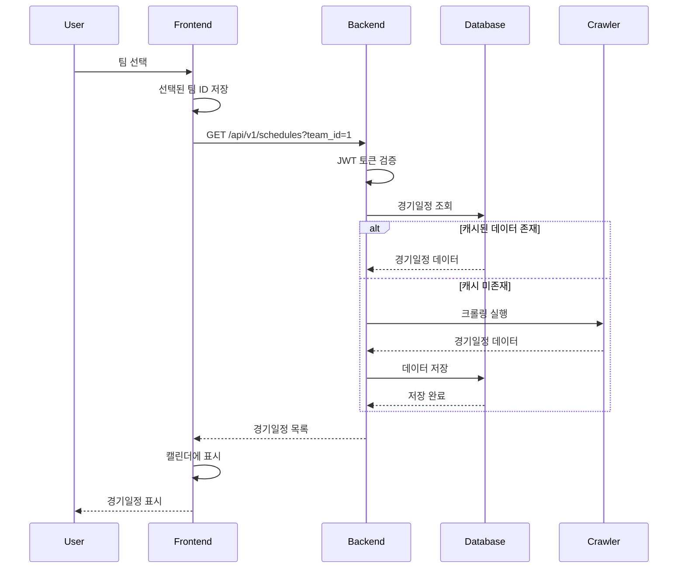
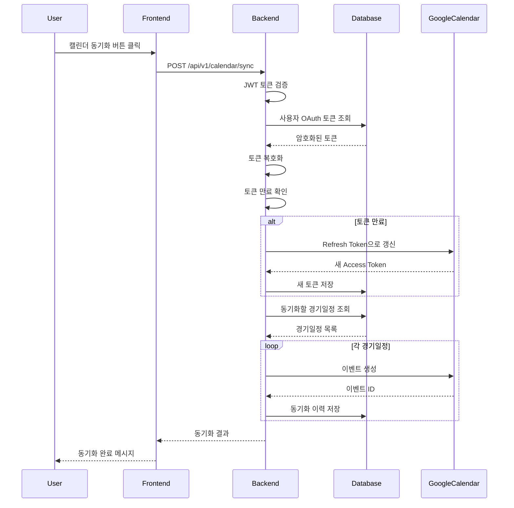
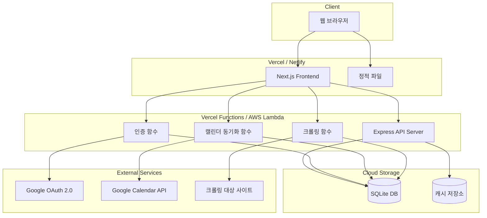
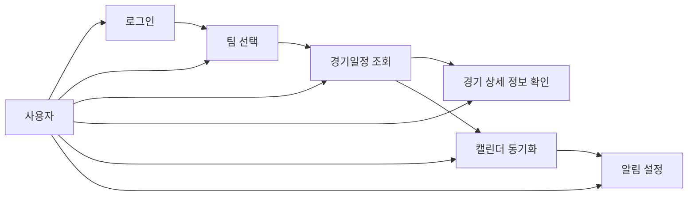
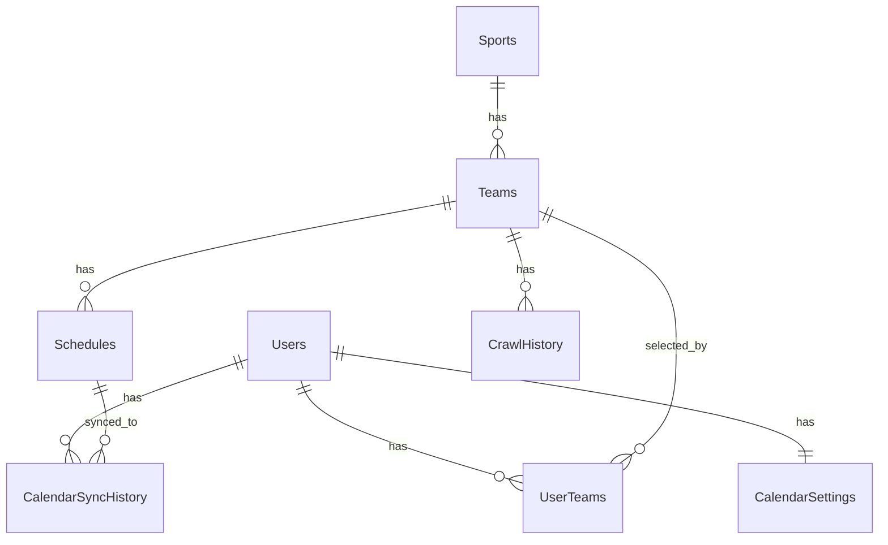

# 스포츠팀 경기일정 캘린더 웹사이트 상세 설계서

## 1. 시스템 개요

### 1.1 시스템의 목적

스포츠팀 경기일정 캘린더 웹사이트는 10살 아동이 좋아하는 스포츠팀의 경기일정을 자동으로 수집하여 캘린더 형태로 시각화하고, Google 캘린더에 자동으로 동기화하는 웹 애플리케이션입니다.

### 1.2 아키텍처 개요

본 시스템은 **모놀리식 아키텍처**를 채택하여 구현됩니다.

```
┌─────────────────────────────────────────┐
│         Frontend (Next.js)              │
│  - React 컴포넌트                       │
│  - shadcn/ui + Tailwind CSS            │
│  - 캘린더 UI                            │
└─────────────────┬───────────────────────┘
                  │ REST API
┌─────────────────▼───────────────────────┐
│         Backend (Node.js/Express)        │
│  - RESTful API                           │
│  - Google OAuth 2.0 인증 처리           │
│  - 크롤링 스케줄러                       │
│  - Google Calendar API 클라이언트        │
└─────────────────┬───────────────────────┘
                  │
┌─────────────────▼───────────────────────┐
│         Data Layer (SQLite)              │
│  - 사용자 정보                           │
│  - 크롤링 데이터 캐시                     │
│  - OAuth 토큰 (암호화)                   │
└─────────────────────────────────────────┘
                  │
┌─────────────────▼───────────────────────┐
│         External APIs                    │
│  - Google Calendar API (REST)           │
│  - Google OAuth 2.0 서버                 │
│  - 크롤링 대상 웹사이트                  │
└─────────────────────────────────────────┘
```

### 1.3 기술 스택

#### Frontend
- **프레임워크**: Next.js 14+ (App Router)
- **UI 라이브러리**: shadcn/ui + Tailwind CSS
- **캘린더 라이브러리**: react-big-calendar 또는 fullcalendar-react
- **상태 관리**: React Hooks (useState, useEffect, useReducer)
- **아이콘**: lucide-react

#### Backend
- **런타임**: Node.js 18+
- **프레임워크**: Express.js
- **인증**: Google OAuth 2.0 (google-auth-library)
- **캘린더 API**: googleapis (Google Calendar API)
- **크롤링**: Puppeteer 또는 Cheerio
- **데이터베이스**: SQLite (sqlite3)

#### 인프라
- **프론트엔드 호스팅**: Vercel 또는 Netlify
- **백엔드 호스팅**: Vercel Functions 또는 AWS Lambda
- **데이터베이스**: SQLite 파일 (클라우드 스토리지 또는 서버리스 환경)

---

## 2. 컴포넌트 설계

### 2.1 Frontend 컴포넌트

#### 2.1.1 인증 컴포넌트

**GoogleLoginButton**
```typescript
// components/features/GoogleLoginButton.tsx
interface GoogleLoginButtonProps {
  onSuccess?: (user: User) => void;
  onError?: (error: Error) => void;
}

export function GoogleLoginButton({ onSuccess, onError }: GoogleLoginButtonProps) {
  // Google OAuth 로그인 처리
  // - /api/v1/auth/google 엔드포인트 호출
  // - 리디렉션 처리
  // - 성공/실패 콜백
}
```

**속성**:
- `onSuccess`: 로그인 성공 시 콜백
- `onError`: 로그인 실패 시 콜백

**메서드**:
- `handleLogin()`: Google OAuth 로그인 시작
- `handleCallback(code: string)`: OAuth 콜백 처리

#### 2.1.2 데이터 선택 컴포넌트

**SportSelector**
```typescript
// components/features/SportSelector.tsx
interface SportSelectorProps {
  selectedSportId?: number;
  onSelect: (sportId: number) => void;
  disabled?: boolean;
}

export function SportSelector({ selectedSportId, onSelect, disabled }: SportSelectorProps) {
  // 스포츠 종목 목록 조회
  // - GET /api/v1/sports 호출
  // - 드롭다운 또는 버튼 그룹으로 표시
  // - 선택 시 onSelect 콜백 호출
}
```

**TeamSelector**
```typescript
// components/features/TeamSelector.tsx
interface TeamSelectorProps {
  sportId: number;
  selectedTeamId?: number;
  onSelect: (teamId: number) => void;
  disabled?: boolean;
}

export function TeamSelector({ sportId, selectedTeamId, onSelect, disabled }: TeamSelectorProps) {
  // 팀 목록 조회
  // - GET /api/v1/teams?sports_id={sportId} 호출
  // - 드롭다운 또는 검색 UI 제공
  // - 선택 시 onSelect 콜백 호출
}
```

#### 2.1.3 캘린더 컴포넌트

**ScheduleCalendar**
```typescript
// components/features/ScheduleCalendar.tsx
interface ScheduleCalendarProps {
  teamId: number;
  currentMonth: Date;
  onMonthChange: (month: Date) => void;
  onGameClick: (schedule: Schedule) => void;
}

export function ScheduleCalendar({
  teamId,
  currentMonth,
  onMonthChange,
  onGameClick,
}: ScheduleCalendarProps) {
  // 경기일정 조회
  // - GET /api/v1/schedules?team_id={teamId}&start_date={start}&end_date={end} 호출
  // - 월별 캘린더 그리드 표시
  // - 경기일정 아이콘 표시
  // - 클릭 시 onGameClick 콜백 호출
}
```

**GameDetailModal**
```typescript
// components/features/GameDetailModal.tsx
interface GameDetailModalProps {
  schedule: Schedule;
  open: boolean;
  onClose: () => void;
  onAddToCalendar?: (schedule: Schedule) => void;
}

export function GameDetailModal({
  schedule,
  open,
  onClose,
  onAddToCalendar,
}: GameDetailModalProps) {
  // 경기 상세 정보 모달 표시
  // - 날짜, 시간, 상대팀, 장소 정보
  // - Google 캘린더에 추가 버튼
}
```

#### 2.1.4 설정 컴포넌트

**CalendarSyncSettings**
```typescript
// components/features/CalendarSyncSettings.tsx
interface CalendarSyncSettingsProps {
  userId: number;
  onSave?: () => void;
}

export function CalendarSyncSettings({ userId, onSave }: CalendarSyncSettingsProps) {
  // 캘린더 연동 설정
  // - GET /api/v1/calendar/list 호출
  // - 캘린더 선택 UI
  // - 자동 동기화 설정
  // - PUT /api/v1/calendar/settings 호출
}
```

### 2.2 Backend 컴포넌트

#### 2.2.1 인증 모듈

**AuthService**
```typescript
// services/AuthService.ts
export class AuthService {
  // Google OAuth 인증 처리
  async initiateGoogleLogin(redirectUri: string): Promise<string>
  async handleGoogleCallback(code: string): Promise<User>
  async refreshToken(userId: number): Promise<TokenPair>
  async logout(userId: number): Promise<void>
  async verifyToken(token: string): Promise<User>
}
```

**메서드 상세**:
- `initiateGoogleLogin()`: Google OAuth 인증 URL 생성
- `handleGoogleCallback()`: 인증 코드를 토큰으로 교환하고 사용자 정보 저장
- `refreshToken()`: 만료된 토큰 자동 갱신
- `logout()`: 사용자 로그아웃 처리
- `verifyToken()`: JWT 토큰 검증

#### 2.2.2 크롤링 모듈

**CrawlerService**
```typescript
// services/CrawlerService.ts
export class CrawlerService {
  // 경기일정 크롤링
  async crawlSchedule(teamId: number): Promise<Schedule[]>
  async parseSchedule(html: string, teamId: number): Promise<Schedule[]>
  async saveSchedules(schedules: Schedule[]): Promise<void>
  async getCrawlHistory(teamId: number): Promise<CrawlHistory[]>
}
```

**메서드 상세**:
- `crawlSchedule()`: 웹사이트에서 경기일정 크롤링
- `parseSchedule()`: HTML 파싱하여 경기일정 데이터 추출
- `saveSchedules()`: 데이터베이스에 경기일정 저장
- `getCrawlHistory()`: 크롤링 이력 조회

#### 2.2.3 캘린더 연동 모듈

**CalendarSyncService**
```typescript
// services/CalendarSyncService.ts
export class CalendarSyncService {
  // Google Calendar 연동
  async listCalendars(userId: number): Promise<Calendar[]>
  async syncSchedule(userId: number, scheduleIds: number[]): Promise<SyncResult>
  async createEvent(userId: number, schedule: Schedule): Promise<string>
  async updateEvent(userId: number, eventId: string, schedule: Schedule): Promise<void>
  async deleteEvent(userId: number, eventId: string): Promise<void>
  async getSyncStatus(userId: number): Promise<SyncStatus>
}
```

**메서드 상세**:
- `listCalendars()`: 사용자의 Google 캘린더 목록 조회
- `syncSchedule()`: 경기일정을 Google 캘린더에 동기화
- `createEvent()`: Google Calendar에 이벤트 생성
- `updateEvent()`: 기존 이벤트 업데이트
- `deleteEvent()`: 이벤트 삭제
- `getSyncStatus()`: 동기화 상태 조회

---

## 3. 4+1 View 모델

### 3.1 논리 뷰 (Logical View)

논리 뷰는 시스템의 주요 컴포넌트와 그들 간의 관계를 보여줍니다.



### 3.2 개발 뷰 (Development View)

개발 뷰는 프로젝트의 디렉토리 구조와 개발 환경을 보여줍니다.

#### 프로젝트 디렉토리 구조

```
sports-schedule-calendar/
├── frontend/
│   ├── src/
│   │   ├── app/
│   │   │   ├── (auth)/
│   │   │   │   ├── login/
│   │   │   │   │   └── page.tsx
│   │   │   │   └── layout.tsx
│   │   │   ├── dashboard/
│   │   │   │   └── page.tsx
│   │   │   ├── settings/
│   │   │   │   ├── calendar/
│   │   │   │   │   └── page.tsx
│   │   │   │   └── notifications/
│   │   │   │       └── page.tsx
│   │   │   └── layout.tsx
│   │   ├── components/
│   │   │   ├── ui/
│   │   │   │   ├── button.tsx
│   │   │   │   ├── input.tsx
│   │   │   │   ├── card.tsx
│   │   │   │   ├── select.tsx
│   │   │   │   ├── dialog.tsx
│   │   │   │   └── ...
│   │   │   ├── layout/
│   │   │   │   ├── Header.tsx
│   │   │   │   ├── Sidebar.tsx
│   │   │   │   └── Footer.tsx
│   │   │   └── features/
│   │   │       ├── GoogleLoginButton.tsx
│   │   │       ├── SportSelector.tsx
│   │   │       ├── TeamSelector.tsx
│   │   │       ├── ScheduleCalendar.tsx
│   │   │       ├── GameDetailModal.tsx
│   │   │       ├── CalendarSyncSettings.tsx
│   │   │       └── NotificationSettings.tsx
│   │   ├── lib/
│   │   │   ├── utils.ts
│   │   │   ├── api.ts
│   │   │   └── auth.ts
│   │   ├── hooks/
│   │   │   ├── useAuth.ts
│   │   │   ├── useSchedule.ts
│   │   │   └── useCalendar.ts
│   │   ├── types/
│   │   │   └── index.ts
│   │   └── styles/
│   │       └── globals.css
│   ├── public/
│   │   └── images/
│   ├── package.json
│   ├── tsconfig.json
│   ├── tailwind.config.js
│   └── next.config.js
│
├── backend/
│   ├── src/
│   │   ├── routes/
│   │   │   ├── auth.routes.ts
│   │   │   ├── schedule.routes.ts
│   │   │   ├── calendar.routes.ts
│   │   │   └── team.routes.ts
│   │   ├── controllers/
│   │   │   ├── auth.controller.ts
│   │   │   ├── schedule.controller.ts
│   │   │   ├── calendar.controller.ts
│   │   │   └── team.controller.ts
│   │   ├── services/
│   │   │   ├── AuthService.ts
│   │   │   ├── CrawlerService.ts
│   │   │   ├── CalendarSyncService.ts
│   │   │   └── ScheduleService.ts
│   │   ├── models/
│   │   │   ├── User.ts
│   │   │   ├── Schedule.ts
│   │   │   ├── Team.ts
│   │   │   └── CalendarSettings.ts
│   │   ├── database/
│   │   │   ├── db.ts
│   │   │   ├── migrations/
│   │   │   └── seeds/
│   │   ├── middleware/
│   │   │   ├── auth.middleware.ts
│   │   │   ├── error.middleware.ts
│   │   │   └── validation.middleware.ts
│   │   ├── utils/
│   │   │   ├── encryption.ts
│   │   │   ├── logger.ts
│   │   │   └── validator.ts
│   │   └── config/
│   │       ├── database.config.ts
│   │       ├── oauth.config.ts
│   │       └── app.config.ts
│   ├── tests/
│   │   ├── unit/
│   │   ├── integration/
│   │   └── e2e/
│   ├── package.json
│   ├── tsconfig.json
│   └── .env.example
│
├── shared/
│   └── types/
│       └── index.ts
│
├── docs/
│   ├── adr.md
│   ├── database.md
│   ├── api-spec.md
│   └── ui-design.md
│
├── .gitignore
├── README.md
└── package.json (workspace root)
```

#### 주요 라이브러리

**Frontend**:
```json
{
  "dependencies": {
    "next": "^14.0.0",
    "react": "^18.0.0",
    "react-dom": "^18.0.0",
    "@radix-ui/react-dialog": "^1.0.0",
    "@radix-ui/react-select": "^1.0.0",
    "tailwindcss": "^3.3.0",
    "lucide-react": "^0.294.0",
    "react-big-calendar": "^1.8.0"
  }
}
```

**Backend**:
```json
{
  "dependencies": {
    "express": "^4.18.0",
    "googleapis": "^126.0.0",
    "google-auth-library": "^9.0.0",
    "sqlite3": "^5.1.0",
    "puppeteer": "^21.0.0",
    "cheerio": "^1.0.0",
    "jsonwebtoken": "^9.0.0",
    "bcrypt": "^5.1.0",
    "cors": "^2.8.5",
    "dotenv": "^16.3.0"
  }
}
```

#### 개발 도구

- **언어**: TypeScript 5.0+
- **패키지 관리**: npm 또는 yarn
- **코드 포맷팅**: Prettier
- **린팅**: ESLint
- **테스트**: Jest, React Testing Library
- **버전 관리**: Git

### 3.3 프로세스 뷰 (Process View)

프로세스 뷰는 시스템의 동적 동작을 시퀀스 다이어그램으로 보여줍니다.

#### 사용자 로그인 프로세스



#### 경기일정 조회 프로세스



#### Google 캘린더 동기화 프로세스



### 3.4 물리 뷰 (Physical View)

물리 뷰는 시스템의 배포 구조를 보여줍니다.



### 3.5 유스케이스 뷰 (Use Case View)

주요 유스케이스를 다이어그램으로 보여줍니다.



#### 유스케이스 상세

**UC1: 로그인**
- **액터**: 사용자
- **전제조건**: 없음
- **기본 흐름**:
  1. 사용자가 Google 로그인 버튼 클릭
  2. Google OAuth 인증 페이지로 리디렉션
  3. 사용자가 Google 계정으로 로그인 및 권한 승인
  4. 시스템이 사용자 정보를 저장하고 JWT 토큰 발급
  5. 대시보드로 리디렉션

**UC2: 팀 선택**
- **액터**: 인증된 사용자
- **전제조건**: 로그인 완료
- **기본 흐름**:
  1. 사용자가 스포츠 종목 선택
  2. 시스템이 해당 종목의 팀 목록 표시
  3. 사용자가 팀 선택
  4. 시스템이 선택된 팀의 경기일정 조회

**UC3: 경기일정 조회**
- **액터**: 인증된 사용자
- **전제조건**: 팀 선택 완료
- **기본 흐름**:
  1. 시스템이 선택된 팀의 경기일정 조회
  2. 캘린더 형태로 경기일정 표시
  3. 경기가 있는 날짜에 아이콘 표시

**UC4: 경기 상세 정보 확인**
- **액터**: 인증된 사용자
- **전제조건**: 경기일정 표시 중
- **기본 흐름**:
  1. 사용자가 경기일정 아이콘 클릭
  2. 시스템이 경기 상세 정보 모달 표시
  3. 날짜, 시간, 상대팀, 장소 정보 표시

**UC5: 캘린더 동기화**
- **액터**: 인증된 사용자
- **전제조건**: 로그인 완료, Google 캘린더 권한 승인
- **기본 흐름**:
  1. 사용자가 캘린더 동기화 버튼 클릭
  2. 시스템이 Google 캘린더 목록 조회
  3. 사용자가 캘린더 선택
  4. 시스템이 경기일정을 Google 캘린더에 이벤트로 추가
  5. 동기화 완료 메시지 표시

**UC6: 알림 설정**
- **액터**: 인증된 사용자
- **전제조건**: 로그인 완료
- **기본 흐름**:
  1. 사용자가 설정 메뉴 선택
  2. 시스템이 알림 설정 화면 표시
  3. 사용자가 이메일/푸시 알림 옵션 선택
  4. 사용자가 알림 시점 선택
  5. 시스템이 설정 저장

---

## 4. 데이터 모델

### 4.1 데이터베이스 스키마

데이터베이스 설계서를 참고하여 상세 스키마를 정의합니다. (자세한 내용은 `sports-schedule-calendar-database.md` 참조)

### 4.2 주요 엔터티 관계



### 4.3 데이터 타입 정의

```typescript
// shared/types/index.ts

export interface User {
  user_id: number;
  google_user_id: string;
  email: string;
  name: string;
  profile_image_url?: string;
  is_active: boolean;
  created_at: string;
  last_login_at: string;
}

export interface Sport {
  sports_id: number;
  sports_name: string;
  display_order: number;
  is_active: boolean;
}

export interface Team {
  team_id: number;
  sports_id: number;
  team_name: string;
  team_official_name?: string;
  crawl_url: string;
  is_active: boolean;
}

export interface Schedule {
  schedule_id: number;
  team_id: number;
  team_name: string;
  game_date: string; // YYYY-MM-DD
  game_time?: string; // HH:MM
  opponent_team: string;
  venue_type: 'HOME' | 'AWAY';
  venue_name?: string;
  game_status: 'SCHEDULED' | 'IN_PROGRESS' | 'FINISHED' | 'CANCELLED';
  game_result?: string;
  score?: string;
  crawled_at: string;
  updated_at?: string;
}

export interface CalendarSettings {
  settings_id: number;
  user_id: number;
  google_calendar_id: string;
  calendar_name: string;
  auto_sync: boolean;
  sync_interval: 'HOURLY' | 'DAILY' | 'WEEKLY';
  email_notification: boolean;
  push_notification: boolean;
  notification_timing: string;
  calendar_color?: string;
  is_shared: boolean;
  created_at: string;
  updated_at?: string;
}

export interface CalendarSyncHistory {
  sync_id: number;
  user_id: number;
  schedule_id: number;
  google_event_id?: string;
  sync_status: 'SUCCESS' | 'FAILED' | 'PENDING';
  synced_at: string;
  error_message?: string;
  error_code?: string;
}
```

---

## 5. API 설계

API 명세서를 참고하여 상세 설계를 정의합니다. (자세한 내용은 `sports-schedule-calendar-api-spec.md` 참조)

### 5.1 주요 API 엔드포인트

| 메서드 | 경로 | 설명 | 인증 |
|--------|------|------|------|
| GET | `/api/v1/auth/google` | Google OAuth 로그인 시작 | ❌ |
| GET | `/api/v1/auth/google/callback` | Google OAuth 콜백 | ❌ |
| POST | `/api/v1/auth/logout` | 로그아웃 | ✅ |
| GET | `/api/v1/sports` | 스포츠 종목 목록 | ✅ |
| GET | `/api/v1/teams` | 팀 목록 | ✅ |
| GET | `/api/v1/schedules` | 경기일정 조회 | ✅ |
| POST | `/api/v1/schedules/crawl` | 크롤링 실행 | ✅ |
| GET | `/api/v1/calendar/list` | Google 캘린더 목록 | ✅ |
| POST | `/api/v1/calendar/sync` | 캘린더 동기화 | ✅ |
| PUT | `/api/v1/calendar/settings` | 캘린더 설정 수정 | ✅ |

### 5.2 API 구현 예시

#### 인증 엔드포인트 구현

```typescript
// backend/src/routes/auth.routes.ts
import { Router } from 'express';
import { AuthController } from '../controllers/auth.controller';
import { authMiddleware } from '../middleware/auth.middleware';

const router = Router();
const authController = new AuthController();

router.get('/google', authController.initiateGoogleLogin);
router.get('/google/callback', authController.handleGoogleCallback);
router.post('/logout', authMiddleware, authController.logout);
router.get('/me', authMiddleware, authController.getCurrentUser);

export default router;
```

```typescript
// backend/src/controllers/auth.controller.ts
import { Request, Response } from 'express';
import { AuthService } from '../services/AuthService';

export class AuthController {
  private authService: AuthService;

  constructor() {
    this.authService = new AuthService();
  }

  async initiateGoogleLogin(req: Request, res: Response) {
    try {
      const redirectUri = `${req.protocol}://${req.get('host')}/api/v1/auth/google/callback`;
      const authUrl = await this.authService.initiateGoogleLogin(redirectUri);
      res.redirect(authUrl);
    } catch (error) {
      res.status(500).json({
        error: 'OAUTH_ERROR',
        message: 'OAuth 설정 오류가 발생했습니다',
        details: {},
      });
    }
  }

  async handleGoogleCallback(req: Request, res: Response) {
    try {
      const { code } = req.query;
      if (!code || typeof code !== 'string') {
        return res.status(400).json({
          error: 'INVALID_CODE',
          message: '유효하지 않은 인증 코드입니다',
          details: {},
        });
      }

      const { user, token } = await this.authService.handleGoogleCallback(code);
      res.json({
        success: true,
        user,
        token,
      });
    } catch (error) {
      res.status(500).json({
        error: 'AUTH_ERROR',
        message: '인증 처리 중 오류가 발생했습니다',
        details: {},
      });
    }
  }

  async logout(req: Request, res: Response) {
    try {
      const userId = (req as any).user.user_id;
      await this.authService.logout(userId);
      res.json({
        success: true,
        message: '로그아웃되었습니다',
      });
    } catch (error) {
      res.status(500).json({
        error: 'LOGOUT_ERROR',
        message: '로그아웃 처리 중 오류가 발생했습니다',
        details: {},
      });
    }
  }

  async getCurrentUser(req: Request, res: Response) {
    try {
      const user = (req as any).user;
      res.json(user);
    } catch (error) {
      res.status(500).json({
        error: 'USER_ERROR',
        message: '사용자 정보 조회 중 오류가 발생했습니다',
        details: {},
      });
    }
  }
}
```

---

## 6. 사용자 인터페이스 설계

UI 컨셉 및 프로토타입 문서를 참고하여 상세 설계를 정의합니다. (자세한 내용은 `sports-schedule-calendar-ui-concept-prototype.md` 참조)

### 6.1 주요 화면 구성

1. **로그인 화면** (`/login`)
   - Google 로그인 버튼
   - 간단한 설명 텍스트

2. **대시보드** (`/dashboard`)
   - 헤더 (로고, 사용자 정보, 설정)
   - 팀 선택 섹션
   - 캘린더 뷰
   - 캘린더 동기화 버튼

3. **설정 화면** (`/settings`)
   - 캘린더 연동 설정
   - 알림 설정

### 6.2 UI 컴포넌트 구현 예시

```tsx
// frontend/src/components/features/ScheduleCalendar.tsx
'use client';

import { useState, useEffect } from 'react';
import { Card } from '@/components/ui/card';
import { Button } from '@/components/ui/button';
import { GameDetailModal } from './GameDetailModal';
import { fetchSchedules } from '@/lib/api';
import type { Schedule } from '@/types';

interface ScheduleCalendarProps {
  teamId: number;
  currentMonth: Date;
  onMonthChange: (month: Date) => void;
}

export function ScheduleCalendar({
  teamId,
  currentMonth,
  onMonthChange,
}: ScheduleCalendarProps) {
  const [schedules, setSchedules] = useState<Schedule[]>([]);
  const [selectedGame, setSelectedGame] = useState<Schedule | null>(null);
  const [loading, setLoading] = useState(true);

  useEffect(() => {
    const loadSchedules = async () => {
      setLoading(true);
      try {
        const startDate = new Date(
          currentMonth.getFullYear(),
          currentMonth.getMonth(),
          1
        ).toISOString().split('T')[0];
        const endDate = new Date(
          currentMonth.getFullYear(),
          currentMonth.getMonth() + 1,
          0
        ).toISOString().split('T')[0];

        const data = await fetchSchedules(teamId, startDate, endDate);
        setSchedules(data.schedules);
      } catch (error) {
        console.error('경기일정 조회 실패:', error);
      } finally {
        setLoading(false);
      }
    };

    if (teamId) {
      loadSchedules();
    }
  }, [teamId, currentMonth]);

  // 캘린더 그리드 생성 로직
  const daysInMonth = new Date(
    currentMonth.getFullYear(),
    currentMonth.getMonth() + 1,
    0
  ).getDate();
  const firstDay = new Date(
    currentMonth.getFullYear(),
    currentMonth.getMonth(),
    1
  ).getDay();

  const days = [];
  for (let i = 0; i < firstDay; i++) {
    days.push(null);
  }
  for (let i = 1; i <= daysInMonth; i++) {
    days.push(i);
  }

  const schedulesByDate = schedules.reduce((acc, schedule) => {
    const date = schedule.game_date;
    if (!acc[date]) {
      acc[date] = [];
    }
    acc[date].push(schedule);
    return acc;
  }, {} as Record<string, Schedule[]>);

  if (loading) {
    return <Card className="p-4">로딩 중...</Card>;
  }

  return (
    <Card className="p-4">
      {/* 월 네비게이션 */}
      <div className="flex items-center justify-between mb-4">
        <Button
          variant="outline"
          onClick={() => {
            const prevMonth = new Date(currentMonth);
            prevMonth.setMonth(prevMonth.getMonth() - 1);
            onMonthChange(prevMonth);
          }}
        >
          ◀ 이전
        </Button>
        <h2 className="text-xl font-bold">
          {currentMonth.getFullYear()}년 {currentMonth.getMonth() + 1}월
        </h2>
        <Button
          variant="outline"
          onClick={() => {
            const nextMonth = new Date(currentMonth);
            nextMonth.setMonth(nextMonth.getMonth() + 1);
            onMonthChange(nextMonth);
          }}
        >
          다음 ▶
        </Button>
      </div>

      {/* 캘린더 그리드 */}
      <div className="grid grid-cols-7 gap-2">
        {['일', '월', '화', '수', '목', '금', '토'].map((day) => (
          <div key={day} className="text-center font-semibold text-sm p-2">
            {day}
          </div>
        ))}

        {days.map((day, index) => {
          const dateStr = day
            ? `${currentMonth.getFullYear()}-${String(currentMonth.getMonth() + 1).padStart(2, '0')}-${String(day).padStart(2, '0')}`
            : null;
          const daySchedules = dateStr ? schedulesByDate[dateStr] || [] : [];

          return (
            <div
              key={index}
              className={`min-h-20 p-2 border rounded-md ${
                day ? 'bg-white' : 'bg-gray-50'
              }`}
            >
              {day && (
                <>
                  <div className="text-sm font-medium mb-1">{day}</div>
                  {daySchedules.map((schedule) => (
                    <button
                      key={schedule.schedule_id}
                      onClick={() => setSelectedGame(schedule)}
                      className="w-full text-left text-xs p-1 bg-blue-100 hover:bg-blue-200 rounded mb-1"
                    >
                      🏟️ {schedule.opponent_team}
                    </button>
                  ))}
                </>
              )}
            </div>
          );
        })}
      </div>

      {/* 경기 상세 모달 */}
      {selectedGame && (
        <GameDetailModal
          schedule={selectedGame}
          open={!!selectedGame}
          onClose={() => setSelectedGame(null)}
        />
      )}
    </Card>
  );
}
```

---

## 7. 보안 설계

### 7.1 인증 및 권한 부여

#### Google OAuth 2.0 인증

**토큰 관리**:
- Access Token: Google API 호출용 (1시간 만료)
- Refresh Token: Access Token 갱신용 (장기 유효)
- JWT Token: 애플리케이션 세션 관리용

**토큰 저장**:
```typescript
// backend/src/services/AuthService.ts
import { encrypt, decrypt } from '../utils/encryption';

export class AuthService {
  async saveTokens(userId: number, tokens: TokenPair) {
    // AES-256 암호화
    const encryptedAccessToken = encrypt(tokens.access_token);
    const encryptedRefreshToken = encrypt(tokens.refresh_token);

    await db.query(
      'UPDATE users SET oauth_token_encrypted = ?, refresh_token_encrypted = ?, token_expires_at = ? WHERE user_id = ?',
      [encryptedAccessToken, encryptedRefreshToken, tokens.expires_at, userId]
    );
  }

  async getTokens(userId: number): Promise<TokenPair> {
    const user = await db.query('SELECT * FROM users WHERE user_id = ?', [userId]);
    
    return {
      access_token: decrypt(user.oauth_token_encrypted),
      refresh_token: decrypt(user.refresh_token_encrypted),
      expires_at: user.token_expires_at,
    };
  }
}
```

#### JWT 토큰 검증

```typescript
// backend/src/middleware/auth.middleware.ts
import { Request, Response, NextFunction } from 'express';
import jwt from 'jsonwebtoken';

export function authMiddleware(req: Request, res: Response, next: NextFunction) {
  const token = req.headers.authorization?.replace('Bearer ', '');

  if (!token) {
    return res.status(401).json({
      error: 'UNAUTHORIZED',
      message: '인증이 필요합니다',
      details: { code: 'AUTH_REQUIRED' },
    });
  }

  try {
    const decoded = jwt.verify(token, process.env.JWT_SECRET!);
    (req as any).user = decoded;
    next();
  } catch (error) {
    return res.status(401).json({
      error: 'UNAUTHORIZED',
      message: '유효하지 않은 토큰입니다',
      details: {},
    });
  }
}
```

### 7.2 데이터 보호

#### 암호화

**OAuth 토큰 암호화**:
```typescript
// backend/src/utils/encryption.ts
import crypto from 'crypto';

const ALGORITHM = 'aes-256-gcm';
const KEY = Buffer.from(process.env.ENCRYPTION_KEY!, 'hex');
const IV_LENGTH = 16;
const AUTH_TAG_LENGTH = 16;

export function encrypt(text: string): string {
  const iv = crypto.randomBytes(IV_LENGTH);
  const cipher = crypto.createCipheriv(ALGORITHM, KEY, iv);
  
  let encrypted = cipher.update(text, 'utf8', 'hex');
  encrypted += cipher.final('hex');
  
  const authTag = cipher.getAuthTag();
  
  return `${iv.toString('hex')}:${authTag.toString('hex')}:${encrypted}`;
}

export function decrypt(encryptedText: string): string {
  const [ivHex, authTagHex, encrypted] = encryptedText.split(':');
  
  const iv = Buffer.from(ivHex, 'hex');
  const authTag = Buffer.from(authTagHex, 'hex');
  
  const decipher = crypto.createDecipheriv(ALGORITHM, KEY, iv);
  decipher.setAuthTag(authTag);
  
  let decrypted = decipher.update(encrypted, 'hex', 'utf8');
  decrypted += decipher.final('utf8');
  
  return decrypted;
}
```

#### 사용자별 데이터 격리

```typescript
// backend/src/services/ScheduleService.ts
export class ScheduleService {
  async getSchedules(userId: number, teamId: number, startDate: string, endDate: string) {
    // 사용자가 선택한 팀인지 확인
    const userTeam = await db.query(
      'SELECT * FROM user_teams WHERE user_id = ? AND team_id = ?',
      [userId, teamId]
    );

    if (!userTeam) {
      throw new Error('권한이 없습니다');
    }

    // 경기일정 조회
    return await db.query(
      'SELECT * FROM schedules WHERE team_id = ? AND game_date >= ? AND game_date <= ?',
      [teamId, startDate, endDate]
    );
  }
}
```

### 7.3 입력 검증

```typescript
// backend/src/middleware/validation.middleware.ts
import { Request, Response, NextFunction } from 'express';
import { z } from 'zod';

export function validateRequest(schema: z.ZodSchema) {
  return (req: Request, res: Response, next: NextFunction) => {
    try {
      schema.parse(req.body);
      next();
    } catch (error) {
      if (error instanceof z.ZodError) {
        return res.status(400).json({
          error: 'VALIDATION_ERROR',
          message: '입력값이 유효하지 않습니다',
          details: error.errors,
        });
      }
      next(error);
    }
  };
}

// 사용 예시
const syncSchema = z.object({
  calendar_id: z.string().min(1),
  team_ids: z.array(z.number()).min(1),
  start_date: z.string().regex(/^\d{4}-\d{2}-\d{2}$/),
  end_date: z.string().regex(/^\d{4}-\d{2}-\d{2}$/),
});

router.post('/calendar/sync', validateRequest(syncSchema), calendarController.sync);
```

---

## 8. 에러 처리 설계

### 8.1 에러 처리 전략

#### 에러 분류

1. **클라이언트 오류 (4xx)**
   - 잘못된 요청
   - 인증 실패
   - 권한 없음
   - 리소스 없음

2. **서버 오류 (5xx)**
   - 내부 서버 오류
   - 데이터베이스 오류
   - 외부 API 오류

3. **외부 서비스 오류**
   - Google OAuth 오류
   - Google Calendar API 오류
   - 크롤링 대상 사이트 오류

#### 에러 처리 미들웨어

```typescript
// backend/src/middleware/error.middleware.ts
import { Request, Response, NextFunction } from 'express';

export function errorHandler(
  err: Error,
  req: Request,
  res: Response,
  next: NextFunction
) {
  console.error('Error:', err);

  // 에러 타입에 따른 처리
  if (err.name === 'ValidationError') {
    return res.status(400).json({
      error: 'VALIDATION_ERROR',
      message: err.message,
      details: {},
    });
  }

  if (err.name === 'UnauthorizedError') {
    return res.status(401).json({
      error: 'UNAUTHORIZED',
      message: '인증이 필요합니다',
      details: {},
    });
  }

  if (err.message.includes('Google API')) {
    return res.status(502).json({
      error: 'EXTERNAL_API_ERROR',
      message: 'Google API 호출 중 오류가 발생했습니다',
      details: { service: 'Google Calendar API' },
    });
  }

  // 기본 에러
  res.status(500).json({
    error: 'INTERNAL_SERVER_ERROR',
    message: '서버 오류가 발생했습니다',
    details: process.env.NODE_ENV === 'development' ? { stack: err.stack } : {},
  });
}
```

### 8.2 재시도 로직

#### Google Calendar API 재시도

```typescript
// backend/src/services/CalendarSyncService.ts
import { google } from 'googleapis';

export class CalendarSyncService {
  private async callWithRetry<T>(
    fn: () => Promise<T>,
    maxRetries = 3,
    delay = 1000
  ): Promise<T> {
    let lastError: Error;

    for (let i = 0; i < maxRetries; i++) {
      try {
        return await fn();
      } catch (error: any) {
        lastError = error;

        // Rate Limit 에러인 경우
        if (error.code === 429) {
          const retryAfter = parseInt(error.response.headers['retry-after'] || '60');
          await new Promise(resolve => setTimeout(resolve, retryAfter * 1000));
          continue;
        }

        // 재시도 가능한 에러인 경우
        if (i < maxRetries - 1 && this.isRetryableError(error)) {
          await new Promise(resolve => setTimeout(resolve, delay * Math.pow(2, i)));
          continue;
        }

        throw error;
      }
    }

    throw lastError!;
  }

  private isRetryableError(error: any): boolean {
    // 네트워크 오류, 타임아웃, 일시적 서버 오류
    return (
      error.code === 'ECONNRESET' ||
      error.code === 'ETIMEDOUT' ||
      error.code === 503 ||
      error.code === 502
    );
  }

  async createEvent(userId: number, schedule: Schedule): Promise<string> {
    const tokens = await this.authService.getTokens(userId);
    const auth = new google.auth.OAuth2();
    auth.setCredentials(tokens);

    const calendar = google.calendar({ version: 'v3', auth });

    return await this.callWithRetry(async () => {
      const response = await calendar.events.insert({
        calendarId: 'primary',
        requestBody: {
          summary: `${schedule.team_name} vs ${schedule.opponent_team}`,
          description: `경기일정: ${schedule.venue_name || '장소 미정'}`,
          start: {
            dateTime: `${schedule.game_date}T${schedule.game_time || '18:00'}:00`,
            timeZone: 'Asia/Seoul',
          },
          end: {
            dateTime: `${schedule.game_date}T${schedule.game_time || '20:00'}:00`,
            timeZone: 'Asia/Seoul',
          },
          location: schedule.venue_name,
        },
      });

      return response.data.id!;
    });
  }
}
```

### 8.3 로깅

```typescript
// backend/src/utils/logger.ts
import winston from 'winston';

export const logger = winston.createLogger({
  level: process.env.LOG_LEVEL || 'info',
  format: winston.format.combine(
    winston.format.timestamp(),
    winston.format.errors({ stack: true }),
    winston.format.json()
  ),
  transports: [
    new winston.transports.Console({
      format: winston.format.combine(
        winston.format.colorize(),
        winston.format.simple()
      ),
    }),
    new winston.transports.File({ filename: 'error.log', level: 'error' }),
    new winston.transports.File({ filename: 'combined.log' }),
  ],
});

// 사용 예시
logger.info('경기일정 크롤링 시작', { teamId: 1 });
logger.error('크롤링 실패', { error: error.message, teamId: 1 });
```

---

## 9. 테스트 전략

### 9.1 단위 테스트

```typescript
// backend/tests/unit/services/AuthService.test.ts
import { AuthService } from '../../../src/services/AuthService';
import { describe, it, expect, beforeEach } from '@jest/globals';

describe('AuthService', () => {
  let authService: AuthService;

  beforeEach(() => {
    authService = new AuthService();
  });

  it('should generate OAuth URL', async () => {
    const url = await authService.initiateGoogleLogin('http://localhost:3000/callback');
    expect(url).toContain('accounts.google.com');
    expect(url).toContain('client_id');
  });

  it('should handle OAuth callback', async () => {
    // 모의 테스트
  });
});
```

### 9.2 통합 테스트

```typescript
// backend/tests/integration/api/auth.test.ts
import request from 'supertest';
import app from '../../../src/app';

describe('Auth API', () => {
  it('should redirect to Google OAuth', async () => {
    const response = await request(app)
      .get('/api/v1/auth/google')
      .expect(302);
    
    expect(response.headers.location).toContain('accounts.google.com');
  });
});
```

### 9.3 E2E 테스트

```typescript
// frontend/tests/e2e/login.test.ts
import { test, expect } from '@playwright/test';

test('로그인 플로우', async ({ page }) => {
  await page.goto('http://localhost:3000/login');
  
  await page.click('text=Google로 로그인');
  
  // Google OAuth 페이지로 리디렉션 확인
  await expect(page).toHaveURL(/accounts.google.com/);
});
```

---

## 10. 배포 고려사항

### 10.1 환경 변수

```bash
# .env.example
# Google OAuth
GOOGLE_CLIENT_ID=your_client_id
GOOGLE_CLIENT_SECRET=your_client_secret
GOOGLE_REDIRECT_URI=http://localhost:3000/api/v1/auth/google/callback

# JWT
JWT_SECRET=your_jwt_secret

# Encryption
ENCRYPTION_KEY=your_32_byte_hex_key

# Database
DATABASE_PATH=./data/sports_schedule.db

# Server
PORT=3000
NODE_ENV=development
```

### 10.2 배포 절차

1. **프론트엔드 배포** (Vercel)
   ```bash
   vercel --prod
   ```

2. **백엔드 배포** (Vercel Functions)
   ```bash
   vercel --prod
   ```

3. **데이터베이스 마이그레이션**
   ```bash
   npm run migrate
   ```

### 10.3 모니터링

- **에러 로깅**: Winston 로거 사용
- **성능 모니터링**: Vercel Analytics
- **알림**: 에러 발생 시 이메일 알림 (선택)

---

**작성일**: 2025-11-05  
**작성자**: 소프트웨어 엔지니어  
**상태**: 설계 완료

**참고**: 이 상세 설계서는 ADR, 데이터베이스 설계, API 명세, UI 컨셉 문서를 기반으로 작성되었습니다. 실제 구현 시 프로젝트 요구사항에 맞게 조정이 필요할 수 있습니다.

